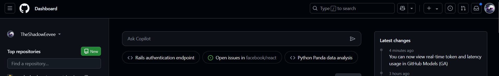
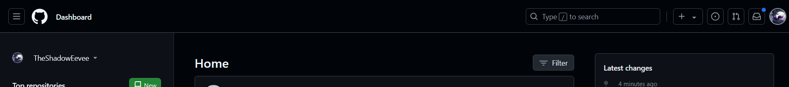

# Welcome to my Commit Overflow 2024 Log!
Commit Overflow is a [Purdue Hackers](https://purduehackers.com) event that is held yearly over the Winter Recess at Purdue University.

:::note[To Add]
This description to be extended later
:::

The format of this post will be a daily update log of my work, similar to what is being submitted to my Commit Overflow thread.

### December 18th: Day 1, Streak 1
While looking for inspiration to start Commit Overflow, I was going to take a look at my website. However, I was interrupted by a little icon on my GitHub homepage. Turns out, GitHub Copilot Free was announced a mere six hours before I began working.

This annoyed me, as I don't like Copilot much, so my project for the day became the creation of a Firefox Add-on that blocks certain Copilot related requests on `https://github.com` and `https://github.githubassets.com`, as well as removed some elements from the DOM related to Copilot.

View it at: https://git.shad.moe/Konpeki-Solutions/Github-Copilot-Blocker

#### Before

#### After
